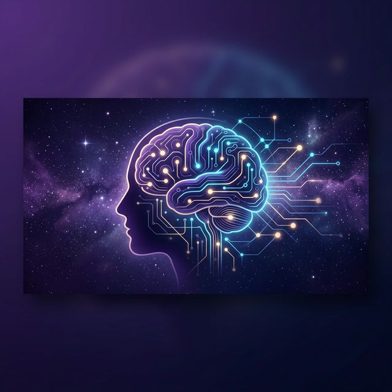
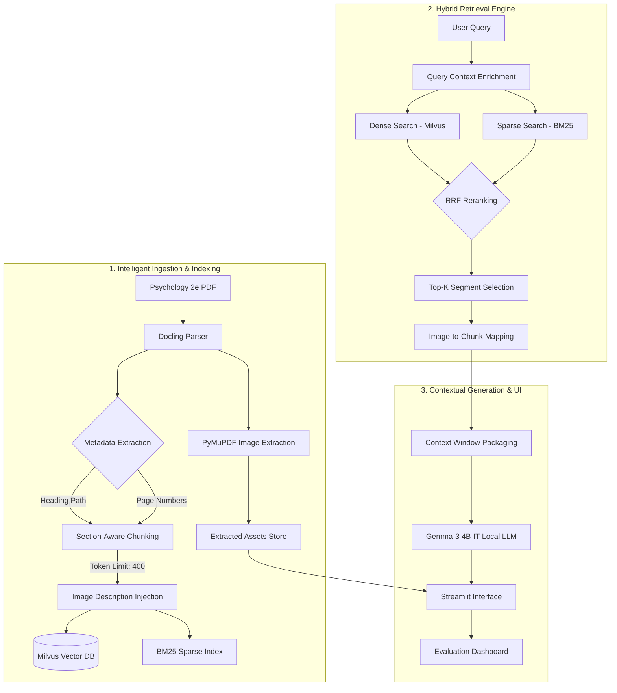

# NeuroNauts 🧠🚀

<p align="center">
  
</p>

<p align="center">
  <b>Advanced AI Learning Companion for Psychology</b> <br/>
  <i>Engineered for the OpenStax Psychology 2e Textbook</i>
</p>

<p align="center">
  
  
  
  
  
  
  
  
  
</p>

---

## 📖 Overview

**NeuroNauts** is a state-of-the-art interactive learning platform designed to revolutionize how students interact with complex academic material. By leveraging a **Hybrid Retrieval-Augmented Generation (RAG)** architecture, it transforms the *OpenStax Psychology 2e* textbook into a dynamic, conversational knowledge base.

Unlike standard LLMs, NeuroNauts provides **hallucination-free** answers by grounding every response in specific textbook segments, complete with page citations and relevant scientific illustrations.

---

## ✨ Key Features

| Feature | Description |
| :--- | :--- |
| **🔍 Hybrid Semantic Search** | Combines **Dense Vector Search** (Milvus) with **Sparse BM25** keyword matching using **Reciprocal Rank Fusion (RRF)** for surgical precision. |
| **📂 Section-Aware Chunking** | Intelligent data ingestion that preserves hierarchical metadata. Chunks never bleed across sections/chapters, ensuring perfect context integrity. |
| **🗺️ Interactive Knowledge Graph** | A dynamic **D3.js-powered visualization** of the textbook's hierarchy, allowing users to explore relationships between psychological concepts. |
| **🖼️ Intelligent Image Retrieval** | Automatically identifies and displays charts, diagrams, and figures associated with the retrieved context inside a lightbox modal. |
| **🧠 Context-Aware Memory** | Handles complex follow-up questions (e.g., "what are parts of it?") by intelligently resolving pronouns against conversation history. |
| **📊 Eval Dashboard** | Built-in evaluation suite that measures **Faithfulness** and **Answer Relevancy** using sentence-level embedding similarity—no ground truth required. |
| **🔒 100% Local & Private** | Runs entirely offline using **LM Studio** and **Gemma models**, ensuring data privacy and zero API costs. |

---

## 🏗️ Detailed Architecture

NeuroNauts follows a sophisticated three-stage pipeline: **Ingestion**, **Retrieval**, and **Generation**. The system is built for accuracy and traceability.



---

## 🚀 Quick Start

### 1. Prerequisites
- **Python 3.10+**
- **Milvus Standalone** running on `localhost:19530`
- **LM Studio** (configured for OpenAI-compatible server on port 1234)
  - *Recommended Models:* `nomic-embed-text-v1.5-GGUF` & `gemma-3-4b-it-Q4_K_M.gguf`

### 2. Installation
```bash
# Clone the repo
git clone https://github.com/Omen-bit/WCEHackathon2026_NeuroNauts.git
cd WCEHackathon2026_NeuroNauts

# Setup environment
python -m venv .venv
source .venv/bin/activate  # Windows: .venv\Scripts\activate

# Install dependencies
pip install -r requirements.txt
```

### 3. Configuration
Create a `.env` file in the root directory:
```env
LM_STUDIO_BASE_URL="http://localhost:1234"
LM_STUDIO_MODEL="nomic-ai/nomic-embed-text-v1.5-GGUF"
LM_STUDIO_LLM_MODEL="gemma-3-4b-it-Q4_K_M.gguf"
```

### 4. Running the App
```bash
streamlit run app/app.py
```

---

## 📁 Project Structure

```text
NeuroNauts/
├── app/                    # Streamlit Frontend & UI Components
│   ├── app.py              # Main Entry Point (Chat Interface)
│   ├── knowledge_graph.py  # D3.js Visualization Engine
│   ├── generate.py         # Local LLM Communication Logic
│   └── retrieve.py         # Hybrid BM25 + Dense Retrieval Rerank
├── pipeline/               # Data Engineering & Ingestion
│   ├── ingest.py           # PDF Parsing (Docling + PyMuPDF)
│   ├── chunk.py            # Section-Aware Semantic Chunking
│   ├── build_bm25.py       # BM25 Sparse Index Builder
│   ├── embed_and_store.py  # Milvus Vectorization Logic
│   └── run_pipeline.py     # End-to-End Ingestion Orchestrator
├── data/                   # Raw Input Data (Psychology Textbook)
├── extracted_images/       # Figures & Scientific Diagrams
├── output/                 # Indices, Mappings & Evaluation JSONs
└── requirements.txt        # System Dependencies
```

---

## 📊 Automated Evaluation

NeuroNauts implements an automated, ground-truth-free evaluation system based on the **RAGAS philosophy**:

1.  **Faithfulness Score:** Ensures the LLM's answer is derived solely from the retrieved context. It breaks the answer into sentences and checks each against the source vectors using a cosine similarity threshold (0.75+).
2.  **Answer Relevancy:** Measures how directly the response addresses the prompt's intent via semantic alignment.

---

## 🤝 Contributing

This project was built for the **WCE Hackathon 2026** by **Team NeuroNauts**. We follow the MIT License and welcome community feedback.

---

## 📜 License

Distributed under the MIT License. See `LICENSE` for more information.

---
<p align="center">Made with ❤️ by Team NeuroNauts</p>

