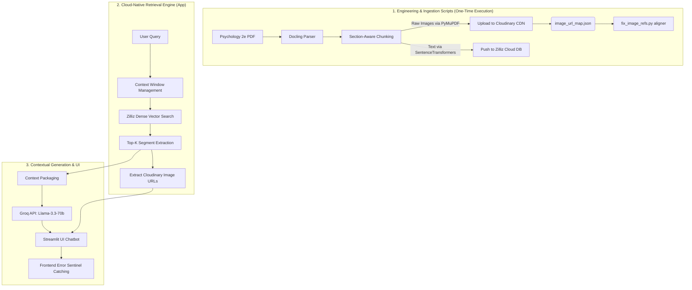

# NeuroNauts 🧠🚀

<p align="center">
  
</p>

<p align="center">
  <b>Advanced AI Learning Companion for Psychology</b> <br/>
  <i>Engineered for the OpenStax Psychology 2e Textbook</i>
</p>

<p align="center">
  
  
  
  
  
  
  
  
  
  
</p>

---

## 📖 Overview

**NeuroNauts** is a state-of-the-art interactive learning platform designed to revolutionize how students interact with complex academic material. By leveraging a **Cloud-Native Retrieval-Augmented Generation (RAG)** architecture, it transforms the *OpenStax Psychology 2e* textbook into a dynamic, conversational knowledge base.

Unlike standard LLMs which frequently hallucinate or confidently invent incorrect academic facts, NeuroNauts provides **hallucination-free** answers by grounding every single response in highly-specific textbook segments. It rapidly serves high-quality Generation via **Groq**, accurate dense vector search via **Zilliz Cloud**, and seamlessly renders contextual infographics, charts, and scientific illustrations directly via **Cloudinary**.

---

## ✨ Key Features

| Feature | Description |
| :--- | :--- |
| **☁️ Cloud-Native Ecosystem** | Built for production performance using **Groq** (Llama-3.3-70b-versatile), **Zilliz Cloud**, and **Cloudinary** CDN image hosting. |
| **🔍 High-Fidelity Retrieval** | Employs `Nomic-Embed-Text` on Zilliz Cloud with strict relevance thresholds (Cosine Similarity > 0.3) ensuring zero-hallucinations. |
| **🛡️ Resilient API Architecture** | Wraps all downstream services (Database, CDN, LLM) in robust exception handling logic, rendering premium UI fallback banners for 401 Auth errors, 429 Rate Limits, and 500 Timeouts. |
| **📂 Section-Aware Chunking** | Intelligent data ingestion via **Docling**. Chunks never bleed across sections/chapters, ensuring perfect context integrity. |
| **🖼️ Intelligent Image Lightbox** | Using **PyMuPDF**, the agent identifies and securely extracts charts/diagrams, serving them from Cloudinary alongside the LLM's text. |
| **🧠 Context-Aware Memory** | Handles complex follow-up questions (e.g., "what are parts of it?") by intelligently resolving pronouns against conversation history. |
| **📊 Headless Eval Suite** | Includes `headless_eval.py` to continuously measure **Faithfulness** and **Answer Relevancy** programmatically across the data pipeline. |

---

## 🏗️ Detailed Architecture

NeuroNauts evolved from a local-prototyped RAG into a highly-scalable cloud MVP. The system handles **Ingestion**, **Retrieval**, and **Generation** over distributed nodes to ensure millisecond-level inference times.



---

## 🚀 Quick Start

### 1. Prerequisites
- **Python 3.10+**
- Keys for the following infrastructure:
  - **Groq API** (For lightning-fast LLM generation)
  - **Zilliz Cloud** (For Serverless Vector Search)
  - **Cloudinary** (For Cloud Image CDN hosting)

### 2. Installation
```bash
# Clone the repo
git clone https://github.com/Omen-bit/WCEHackathon2026_NeuroNauts.git
cd WCEHackathon2026_NeuroNauts

# Create and activate environment
python -m venv .venv
# Windows: .venv\Scripts\activate
# Mac/Linux: source .venv/bin/activate

# Install dependencies
pip install -r requirements.txt
```

### 3. Configuration
Create a `.env` file in the root directory and populate it with your cloud credentials:
```env
# --- GROQ (LLM Gen) ---
GROQ_API_KEY="your-groq-key"
GROQ_MODEL="llama-3.3-70b-versatile"

# --- CLOUDINARY (Images) ---
CLOUDINARY_CLOUD_NAME="your-cloud-name"
CLOUDINARY_API_KEY="your-key"
CLOUDINARY_API_SECRET="your-secret"

# --- ZILLIZ (Vector DB) ---
ZILLIZ_URI="https://your-zilliz-cluster.cloud.zilliz.com"
ZILLIZ_TOKEN="your-zilliz-token"
```

### 4. Running the App
```bash
streamlit run app/app.py
```

---

## 📚 Use Your Own Textbook!

Want to use NeuroNauts for a different textbook? It's incredibly easy to adapt our custom engineering pipeline for any PDF.

1. **Add Your Book**: Place your new PDF in the `data/` or root directory.
2. **Run the Ingestion Pipeline**:
   ```bash
   python pipeline/run_pipeline.py path/to/your_textbook.pdf
   ```
   *This uses **Docling** to intelligently chunk your book specifically by academic headings, and uses **PyMuPDF** to rip out all the native high-res images to an `extracted_images/` folder.*
3. **Upload Assets to CDN**:
   ```bash
   python scripts/upload_images_to_cloud.py
   ```
   *This securely streams your newly extracted textbook images into Cloudinary.*
4. **Push to Vector DB**:
   ```bash
   python scripts/migrate_to_zilliz.py
   python scripts/fix_image_refs.py
   ```
   *This connects the generated cloud URLs to your dense vector DB chunks and pushes everything securely to Zilliz.*
5. **Start Chatting**: Your app is now an expert on your unique textbook!

---

## 📁 Project Structure

```text
WCEHackathon2026_NeuroNauts/
├── app/                        # Streamlit Frontend & Core RAG Logic
│   ├── app.py                  # Main App, Prompt Engineering & UI Rendering
│   ├── retrieve.py             # Zilliz Database Connections & Search logic
│   ├── generate.py             # Groq API Abstraction Layer
│   └── headless_eval.py        # Automated Headless Evaluation Script
├── pipeline/                   # Powerful Automated PDF Ingestion Pipeline
│   └── (Docling Parsers, PyMuPDF extractors, Recursive Chunking)
├── scripts/                    # Infrastructure Migration & Cleanup Toolkit
│   ├── migrate_to_zilliz.py    # Uplift script for moving local DB to Zilliz
│   ├── upload_images_to_cloud.py # Asset migration to Cloudinary
│   └── fix_image_refs.py       # Cloud DB JSON string serialization rectifier
├── queries.json                # Standardized testing metrics
└── requirements.txt            # Modern, cloud-native project dependencies
```

---

## 🤝 Contributing

This project was built for the **WCE Hackathon 2026** by **Team NeuroNauts**. We follow the MIT License and welcome community feedback.

---

## 📜 License

Distributed under the MIT License. See `LICENSE` for more information.

---
<p align="center">Made with ❤️ by Team NeuroNauts</p>
